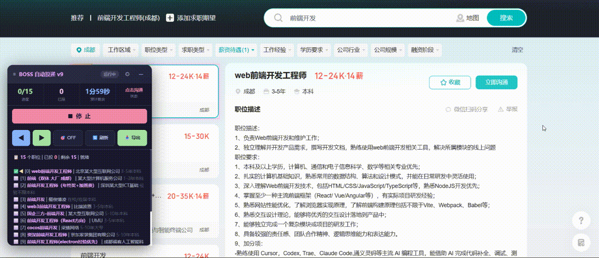
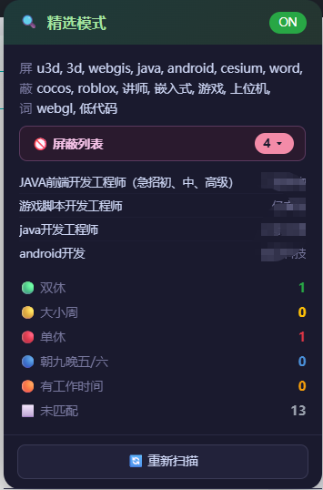
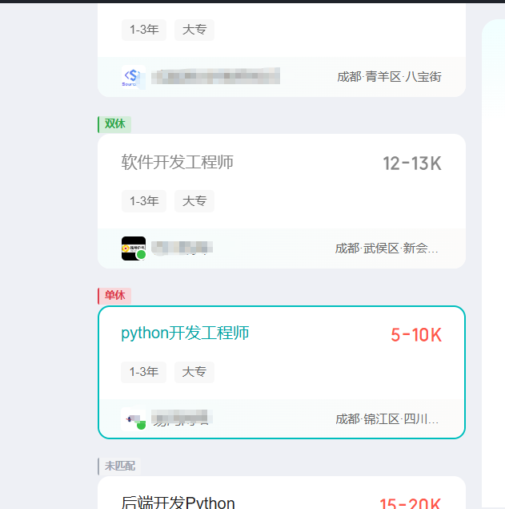

<div align="center">


</div>

<br>

<h1 align="center">💼 BOSS 自动投递</h1>

<p align="center">
  <b>极简 · 极小 · 纯原生</b><br>
  <sub>一个 ~51KB 的 Chrome 扩展，没有 Playwright，没有 Puppeteer，没有框架</sub>
</p>

<p align="center">
  每天 <b>150</b> 次沟通机会<br>
  自动投递 + 精选过滤 + 工作制高亮 + 一键导出<br>
  设好条件 → 一键投递 → 解放双手 🤲
</p>

<br>

---

## 🎬 5 秒看懂

<div align="center">



*从点击开始到自动沟通，全程无人值守*

</div>

<br>

---

## 🆕 v1.1 全新「精选模式」

> 不想一个个翻？开启精选模式，屏蔽词匹配的职位**直接从页面消失**，剩下的自动标注工作制。

<div align="center">

| | |
|:---:|:---:|
| **🔍 精选模式面板** | **🏷 卡片工作制标注** |
|  |  |
| 独立面板，显示屏蔽列表与统计 | 绿/黄/红左边框 + 彩色 badge |

</div>

### 怎么工作的

```
开启精选模式
  │
  ├── 屏蔽词匹配 → display:none 隐藏 (不删 DOM)
  ├── 卡片文本匹配 → 左边框 + 彩色 badge
  │     🟢 双休  🟡 大小周  🔴 单休
  │     🔵 朝九晚五/六  🟠 有工作时间  ⬜ 未匹配
  │
  ├── MutationObserver 监听虚拟列表
  │     └── 新卡片加载 → 立即过滤 + 标注
  │
  └── 点击职位 → 右侧详情 p.desc 加载
        └── 实时解析工作制 → 更新卡片 badge (缓存)
```

<br>

---

## 💡 为什么选它

> 市面上有 Playwright 方案、Selenium 方案、Puppeteer 方案。
> 它们都很重，要装 Python，要配 driver，要写脚本。
>
> **这个只要拖进 Chrome 就能用。**

<table>
<tr>
<td width="33%" align="center">

### 🪶 极轻

<br>

**~51KB** 核心逻辑<br>
没有 `node_modules` 黑洞<br>
没有浏览器驱动<br>
没有 Python 环境

</td>
<td width="33%" align="center">

### 🧬 纯原生

<br>

**零运行时依赖**<br>
不依赖 Playwright<br>
不依赖 Puppeteer<br>
不依赖任何框架<br>
纯 DOM API

</td>
<td width="33%" align="center">

### ⚡ 即装即用

<br>

拖进 Chrome<br>
点开始<br>
**完。**

</td>
</tr>
</table>

<br>

---

## 🖼️ 预览

<div align="center">

| | |
|:---:|:---:|
| **🏠 自动投递面板** | **⚙ 设置面板** |
|  |  |
| 可拖动浮动面板，所有操作一手掌握 | 三档预设 + 独立滑块 + 屏蔽词管理 |

<br>

| **📥 导出记录** |
|:---:|
|  |
| 一键导出 `.txt`，公司、地址、标签、时间一目了然 |

<br>

</div>

<br>

---

## 🚀 快速开始

```bash
npm install && npm run build
```

1. Chrome → `chrome://extensions` → 开启 **开发者模式**
2. **加载已解压的扩展程序** → 选 `dist/` 目录
3. 打开 [BOSS 直聘](https://www.zhipin.com/) 搜索结果页
4. Popup 里打开开关 → 👉 页面右侧浮动面板 → **▶ 开 始**

> 💡 **提示**：构建依赖只有 `esbuild` + `typescript`。运行时不依赖任何第三方库 — 纯 `querySelector` + `MutationObserver` + `XPath` + `setTimeout`。

<br>

---

## 🏗️ 源码结构

```
自动BOSS投递/
├── manifest.json               Chrome MV3 声明
├── esbuild.config.mjs          构建脚本
├── src/
│   ├── shared/types.ts         类型 · 枚举 · 速度预设
│   ├── content/content.ts      🔥 全部核心逻辑（~1200行）
│   ├── popup/                  弹窗（状态 + 双开关）
│   └── background/             Service Worker（消息中继）
├── assets/
│   ├── test.gif                自动投递演示
│   ├── img1.png                导出记录截图
│   ├── img2.png                主页面截图
│   └── img3.png                设置面板截图
└── dist/                       构建产物 → 加载到 Chrome
```

| | |
|---|---|
| 清单 | Manifest V3 |
| 语言 | TypeScript |
| 打包 | esbuild → IIFE |
| 运行时依赖 | **零** |
| 核心大小 | ~51KB（content.js） |
| 持久化 | `chrome.storage.local` |

<br>

---

## 🎮 面板操作

### 自动投递面板

| 操作 | 说明 |
|------|------|
| `≡` 拖动 | 长按拖动面板到任意位置 |
| `▶/⏹` | **同一个按钮**，运行/停止自动切换 |
| `◀ ▶` | 手动浏览职位 |
| `🎯` | 点击检测：点页面元素查看 DOM 信息 |
| `🔄` | 刷新职位列表 |
| `🚫 OFF/ON` | 关键词屏蔽开关 |
| `📥 导出` | 导出投递记录为 `.txt` |
| `⚙` | 速度设置面板 |

### 精选模式面板

| 操作 | 说明 |
|------|------|
| `🚫 屏蔽列表` | 点击展开/折叠，查看具体被屏蔽的职位和公司 |
| `🔄 重新扫描` | 清缓存重新匹配所有卡片 |

<br>

---

## ⚙ 速度预设

| 预设 | 高亮 | 步间延迟 | 加载超时 | 适合 |
|------|------|----------|----------|------|
| 🐢 稳定 | 600ms | 1.2~2.5s | 6s | 网络慢，求稳 |
| ⚡ 推荐 | 350ms | 0.8~1.5s | 4s | 🌟 日常，90%+ 不出错 |
| 🚀 极速 | 150ms | 0.4~0.8s | 2.5s | 网络快，抢速度 |

<br>

---

<div align="center">

### 没有 Playwright。没有 Selenium。没有 800MB 的 node_modules。

### 就一个 ~51KB 的 Chrome 扩展，拖进去，点开始。🎯

<br>

<sub>Made with TypeScript · Chrome Extension API · 纯 DOM 操作</sub>

</div>
