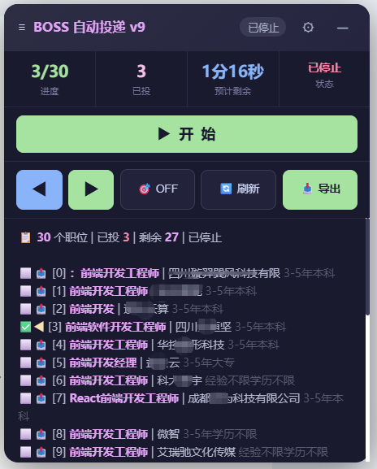
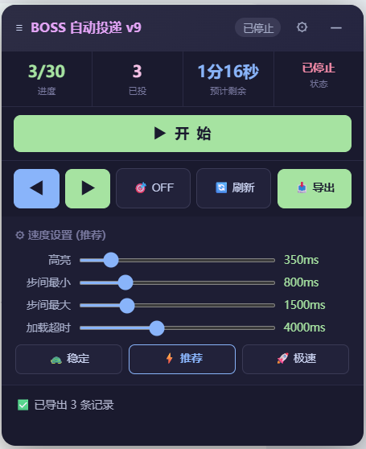
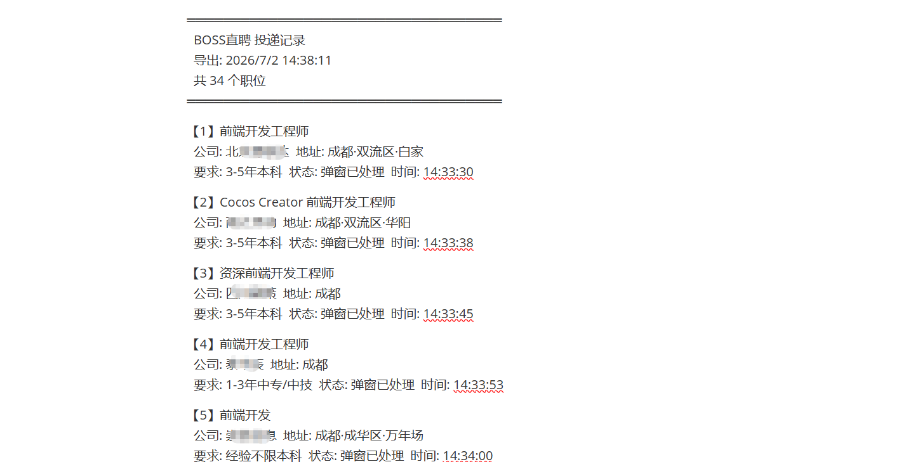

<div align="center">


</div>

<br>

<h1 align="center">💼 BOSS 自动投递</h1>

<p align="center">
  <i>告别每天 150 次的重复点击，一键解放双手 🤲</i>
</p>

<p align="center">
  在 BOSS 直聘上，每天有 <b>150</b> 次沟通机会。<br>
  一个一个点击？不。设置好条件，搜索出结果，然后——<br>
  <b>交给它。</b>
</p>

<br>

---

## ✨ 不只是「自动点击」

<table>
<tr>
<td width="50%">

### 🎯 智能导航

- 状态机驱动，**不是 `while(true)`**，随时安全停止
- 自动识别职位卡片、Boss 名称、公司位置、技能标签
- 虚拟列表 / 无限滚动？没问题——**每次重新查询 DOM，不缓存引用**

</td>
<td width="50%">

### ⚡ 极速稳定

- 三档速度预设：**稳定 / 推荐 / 极速**
- 每个参数独立可调：高亮、步间延迟、加载超时
- 推荐模式 90%+ 不出错，**8 秒/职位**丝滑投递

</td>
</tr>
<tr>
<td>

### 🎛️ 可拖动面板

- 右侧浮动面板，**随意拖动**
- 包含**所有操作**：开始/停止、导航、刷新、导出
- 实时显示：进度、已投、**倒计时剩余时间**

</td>
<td>

### 📥 投递记录 & 导出

- 自动记录每个投递职位的信息
- 一键导出为 `.txt` 文件，包含公司、地址、标签、时间
- 再也**不会忘记投了哪些**

</td>
</tr>
</table>

<br>

---

## 🖼️ 预览

<div align="center">

| | |
|:---:|:---:|
| **🏠 主页面** | **⚙ 设置面板** |
|  |  |
| 可拖动浮动面板，所有操作一手掌握 | 三档预设 + 独立滑块，速度随心调 |

<br>

| **📥 导出记录** |
|:---:|
|  |
| 一键导出投递记录，公司、地址、要求一目了然 |

</div>

<br>

---

## 🚀 快速开始

```bash
# 1. 安装依赖
npm install

# 2. 构建
npm run build
```

然后：

1. 打开 Chrome → `chrome://extensions`
2. 开启右上角 **开发者模式**
3. 点击 **加载已解压的扩展程序** → 选择 `dist/` 目录
4. 打开 [BOSS 直聘](https://www.zhipin.com/)，搜索你想要的职位
5. 👉 看页面右侧的浮动面板，点击 **▶ 开 始**

<br>

---

## 🧠 它是怎么工作的

```
搜索页加载
  │
  ├── 检测职位列表（支持虚拟滚动 / 懒加载）
  ├── 8秒/个 预估算总量，启动倒计时
  │
  ▼
┌────────------───── 状态机循环 ──-------------┐
│                                               │
│  🔍 查找下一条 → ✨ 高亮 → 👆 点击            │
│       │                            │          │
│       ▼                            ▼          │
│   等待详情加载               查找「立即沟通」   │
│                                    │          │
│                           ✨ 高亮 → 👆 点击    │
│                                    │          │
│                              检查弹窗          │
│                               /       \       │
│                          有弹窗      无弹窗    │
│                             │          │      │
│                       点击「留在此页」  记录 ✅ │
│                             │          │      │
│                             └────┬─────┘      │
│                                  │            │
│                           ◀ 下一条 ───────────┘
│
├── 全部完成 / 手动停止
│
▼
✅ 导出记录
```

<br>

---

## 🏗️ 架构

```
自动BOSS投递/
├── manifest.json              ← Chrome MV3 声明
├── esbuild.config.mjs         ← 构建脚本 (esbuild)
├── src/
│   ├── shared/types.ts        ← 类型 · 枚举 · 速度预设 · 常量
│   ├── content/content.ts     ← 🔥 核心：状态机 + DOM + 面板
│   ├── popup/popup.{html,css,ts}  ← 极简弹窗（状态预览）
│   └── background/background.ts   ← Service Worker 消息中继
├── assets/
│   ├── img1.png               ← 导出记录截图
│   ├── img2.png               ← 主页面截图
│   └── img3.png               ← 设置面板截图
└── dist/                      ← 构建产物 → 加载到 Chrome
```

| 技术 | 选择 |
|------|------|
| 清单版本 | Manifest V3 |
| 语言 | TypeScript |
| 打包 | esbuild (IIFE) |
| 流程模型 | 17 状态有限状态机 |
| 定位策略 | `text()` / `role` / `aria-label`（永不依赖随机 class） |
| DOM 策略 | 每次重新查询，零缓存（适配虚拟列表） |
| 反检测 | 全部日志输出到面板 DOM，不写 `console` |

<br>

---

## 🎮 面板操作

| 操作 | 说明 |
|------|------|
| `≡` 拖动区 | 长按拖动面板到任意位置 |
| `▶ 开 始` / `⏹ 停 止` | **同一按钮**，根据状态自动切换 |
| `◀ ▶` | 手动浏览职位列表 |
| `🎯 ON/OFF` | 点击检测模式：点击页面元素显示 DOM 信息 |
| `🔄 刷新` | 重新扫描职位列表 |
| `📥 导出` | 导出投递记录为 `.txt` 文件 |
| `⚙` | 展开速度设置面板 |
| `─` | 折叠/展开面板内容区 |

<br>

---

## ⚙ 速度预设

| 预设 | 高亮 | 步间延迟 | 加载超时 | 适用场景 |
|------|------|----------|----------|----------|
| 🐢 **稳定** | 600ms | 1.2~2.5s | 6s | 网络较慢，求稳 |
| ⚡ **推荐** | 350ms | 0.8~1.5s | 4s | 🌟 日常使用，**90%+ 不出错** |
| 🚀 **极速** | 150ms | 0.4~0.8s | 2.5s | 网络极好，追求速度 |

<br>

---

## 📝 开发

```bash
npm run build     # 单次构建
npm run watch     # 监听模式（文件变更自动构建）
```

修改后：`npm run build` → Chrome `chrome://extensions` → 点击扩展卡片的 🔄 刷新按钮。

<br>

---

<div align="center">

<b>每天 150 次沟通机会，别再手动点了。</b> 🫡

</div>
